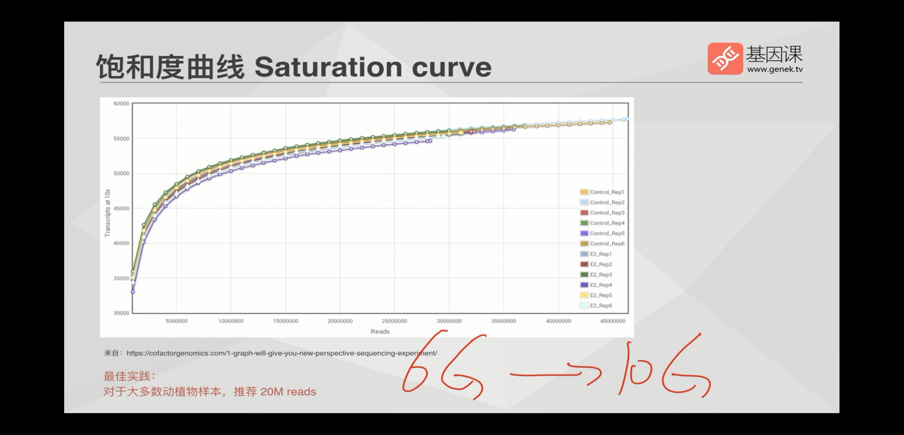
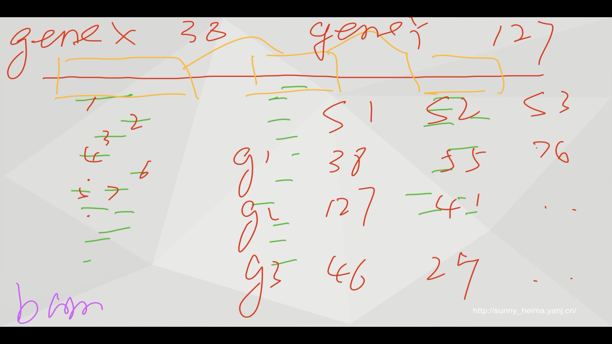
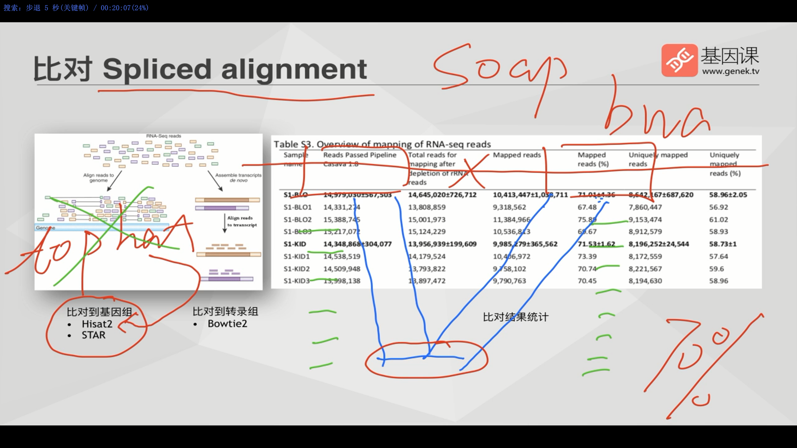
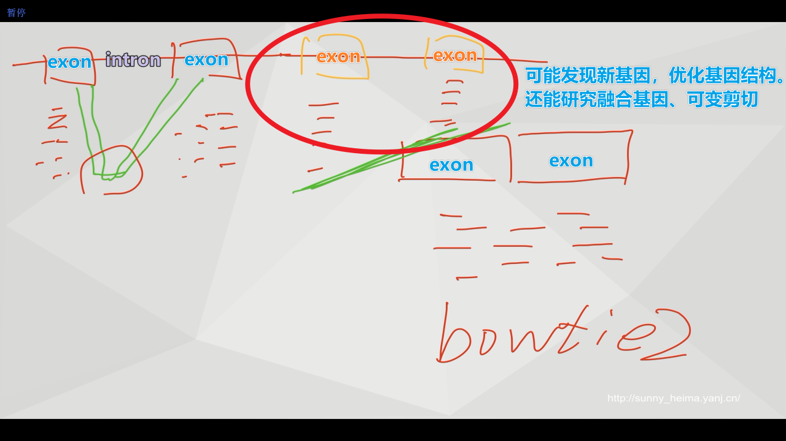
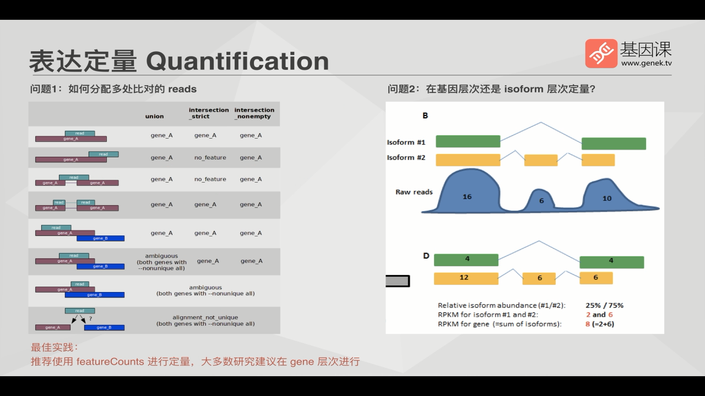
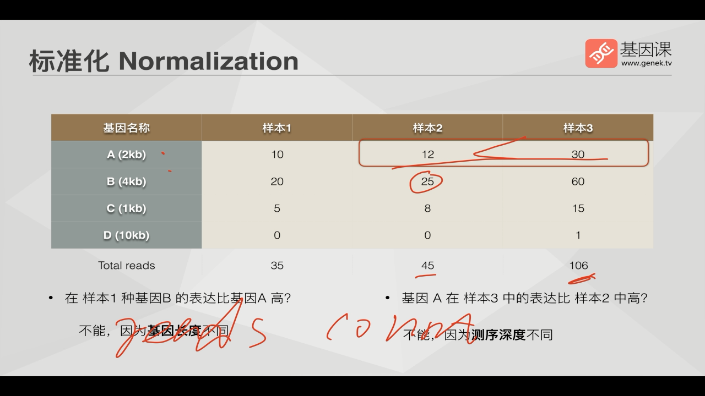
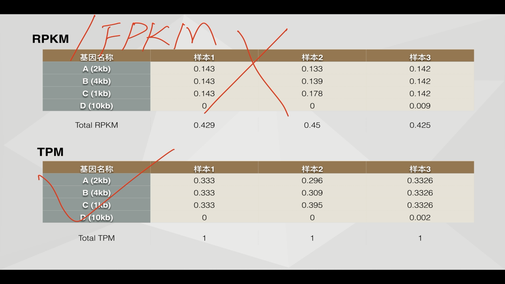
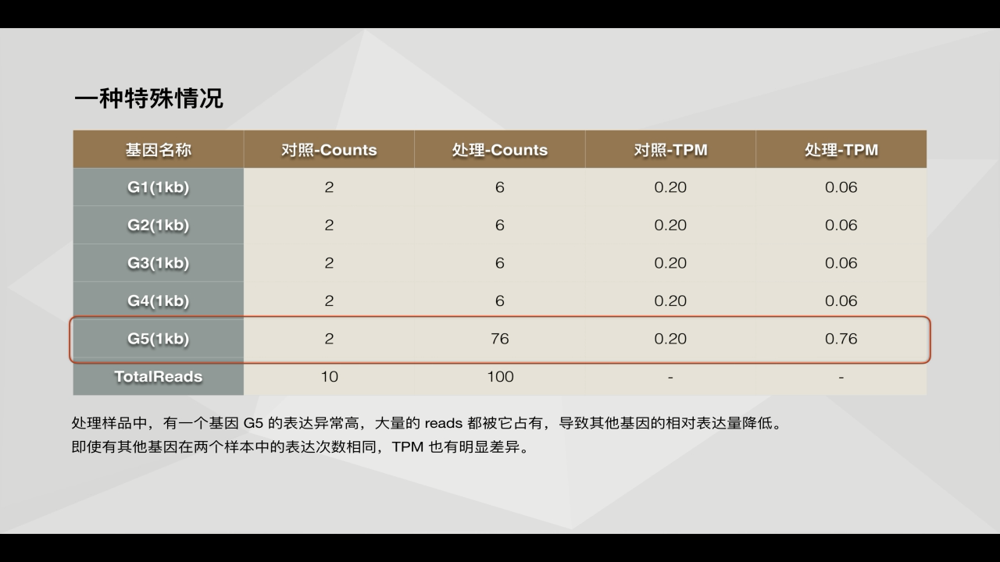

转录组分析流程
---

基本模式：
> - 软件
>   - 功能
>   - 输入
>   - 输出

大纲：
- QC		
  - `fastqc`
    - 查看reads的总体情况
    - fastq
    - QCreport
  - `trim_qc`
    - 过滤得到cleanReads
    - fastq
    - cleanData.fq.gz
- 比对Maping
  - `Hisat2`
    - 将reads Mapping到基因组上
    - gtf, fq.gz, fasta 【gtf 转录本信息 可改？】
    - bam
- 定量
  - featureCount【看看内容】
    - 统计覆盖的reads数
    - bam
    - all.id

> featureCount 的坑  
> - bam错一个，整个结果将不可用。可用samtools views命令看是否正常打开，如`.bam`文件。  
> 【Stringtie？】每一个bam都有一个gtf，能进行进行单独计算】


思维导图：

[]

# 1. 测序数据的处理

表达芯片（前期较早）

RNA-seq（目前基本使用这个来做分析，几乎替代表达芯片）

## 1.1. 数据量问题


测序一般多少较为合适？
6G --> 10G 的数据量（碱基量bp）

6G一般够了，双末端测序一般就有20M的reads数据。

> 对应使用PE测序(双末端测序)的reads数目为20M。  
> 如何计算？  
> 双末端测序的数目150bp*2=300bp，而SE(单末端测序)是150bp  
> 20 M * 300 = 6G  

如图：
  

## 质控

fastqc

FastQC的基本介绍 - 简书【待整理】
https://www.jianshu.com/p/fe6af418a8bc

## 过滤

【待整理】
trim_qc

# 2. 比对
使用 `RNA-seq数据` 比对到 `参考基因组`

## 2.1. 比对到基因组

- 比对算法：Spliced alignment
- 算法特征：算法允许比对时从中间截断，分别比对到基因组。【疑惑，是reads被截断分别比对到基因组的不同位置？？】
- 软件选择：
  - `Hisat2`，综合效能最好，速度大大提升，内存消耗更低，效果仅次于STAR但区别不大。
  - `STAR`，比对效果最好，但更消耗计算资源（运行更久，内存消耗更多）。
  - 其他说明：
    - 早期：早期华大等公司在用soap、bwa等，现在基本作废，因为他们未切分比对，不要使用他们作转录组。
    - 后来：tophat的作者声明不要再用tophat，要使用Hisat2（Hisat的第二个版本）。
    - > - `TopHat + Cufflinks` 软件后来被作者升级为 `Hisat2 + Stringtie`。  
      > - `Stringtie`可以进行转录本拼接预测延伸基因片段以及计算表达量，但一个分析结果并不足以说明延伸基因结构的准确性，需要验证与证明（可能是实验）。  
      > - 如果实在需要进行基因结构的优化，可以使用`PASA`，对原来基因结构进行重新的拼接组装，可重新发一篇基因结构优化的声明文章。
- 结果解读：
  - 比对率 Mapped reads(%)，对于大多数动植物而言，基因组做的不差的前提下，比对率 ***在70%以上*** 较为合理。

图示：
  
  

hisat2：
```bash

```

## 2.2. 比对到转录组

***慎用！！***

【真核生物有可变剪切，而原核生物没有？】

局限性：
- 一般就比对到参考基因组上，通过比对到基因组有可能发现新基因，研究融合基因，可变剪切。
- 而比对到转录组，则会遗失一些基因，方法比较受限。

软件：`bowtie2`

  

## 2.3. 不比对：无参转录组

不推荐做，问题在于会拼接出大量的转录本，意义不大。【如何理解？】

# 3. 定量

**表达定量：** 统计比对落在基因上的reads条数，以此作为表达量计算依据。

**问题一：如何分配多处比对的reads？**（一条read比对到多条基因如何处理？）
- 假如仅有 5% 左右reads 比对到两个及以上基因，影响不大。【可以去除？】
- 假如有一半的reads出现了这种情况，这个转录组项目基本可以不用做了。可以考虑三代转录组进行定量，但当下(2020年)技术尚不成熟且成本高。

延伸问题：重复序列造成的这种问题怎么处理？
  - 处理过程：第一代直接使用uniq丢掉了；第二代直接分别加半票；第三代采用机器学习算法（如贝叶斯等），计算统计可能的概率，给不同基因分别加分(如 gene1 0.3, gene2 0.7)。【具体是指什么软件？没太明白】

**问题二：在基因层次还是isoform层次定量？**
- 两个基本概念：
  - 基因层次：一个基因内的所有外显子。
  - isoform层次：可变剪切的不同转录本。

如：基因层次12次，第一套 isoform 为8次，第二套 isoform 为4次。

- 如何选择：
  - 一般而言，如果研究不是特别深入的话，一般就基因层次就足够了。
  - 当多种不同 isoform 的序列类似，是很难用 isoform层次 来进行定量的。尽量不要折腾 isoform层次 的定量，尽量做基因层次定量。

当出现参考基因组与已知参考基因组的差别较大时，如何解决？
比如同一个属的不同物种一般是不能用的，但比对率还可以也是可以用的。同一个物种的不同亚种是可以用的。还有就是看比对率，如果高于70%，那么也是有可可能能用基因组的。

如图：
  

## 3.1. 软件选择：
- 基于比对率（较为常用，大多数文章需要提到比对率）
  - `htseq`软件包里的`htseq-count`命令 (老软件)
  - `Subread`软件包里的`featureCount`命令 (新软件2014，推荐)
- 基于k-mer频率（较新）
  - `salmon`
  - ...

更多：[转录本定量（二代、三代）——salmon、stringtie - becky_gogogo - 博客园](https://www.cnblogs.com/beckygogogo/p/9849335.html)

# 4. 标准化
问题背景描述：
> 通过`featureCount`获得的`ReadsCount`矩阵数据不能直接进行基因间表达量多少的比较，它们的比较受基因长度不同、测序深度不同所影响。  
> 比如说，一个很长的基因有一点表达，而一个很短的基因全部表达。是不能直接进行数量上的比较的。而测序深度的不同，也会导致直接比较出错。

图示：
  

## 4.1. 标准化方法

1. RPKM/FPKM(单末端/双末端)，后来被证明是错的，详情见：【待补充】。
2. TPM

标准化方法原理：【待补充】

  

  

# IGV可视化

[官网下载](http://software.broadinstitute.org/software/igv/download)

操作步骤：
1. 选择参考基因组。
   - 自定义genomo方法：
     - `Genomes` --> 
     - `Create genome File...` -->
     - 填写名称`FASTA file`与`Gene file`文件路径（fasta, gtf）
2. 导入bam文件(旁边必须带有bai)
   - 方法：
     - File --> ...

疑问：


# 差异表达分析

待吸收：

- 浅谈p值（p-value是什么） - 简书
- https://www.jianshu.com/p/4c9b49878f3d
- Biostatistics(12)常见分布：t分布、卡方分布、F分布 - 简书
- https://www.jianshu.com/p/60e0d77c848c


---

两种方法：

1. deseq2 
空间缩放系数

2. edgeR 
4分位
tmm？均一化方法
可以算 rpkm / fpkm