[TOC]

# 1.  Box plot
## 1.1 Figure 1 
`/disk1/pengweixing/gastric_wgs/02.analysis_filter/boxplot_oncogene_nubmer.r`

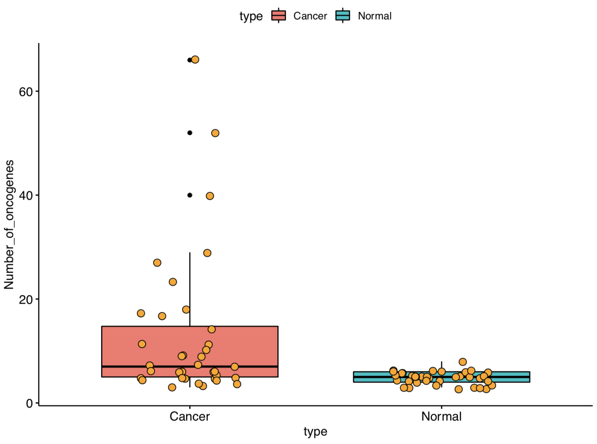  


```R
library("ggpubr")
library("ggplot2")
data = read.table("result.stat.filter.gt4",header = T)
oncogene = data.frame(Number_of_oncogenes=data$oncogenes,type="Cancer")
oncogene2 = data.frame(Number_of_oncogenes=data$oncogenes.1,type="Normal")
oncogene3 = rbind(oncogene,oncogene2)
p=ggboxplot(oncogene3,x="type",y="Number_of_oncogenes",fill="type",add="jitter",add.params=list(shape=21, fill="orange", size=3))
ggsave("result.stat.filter.gt4.oncogene.pdf",plot=p,device="pdf",dpi = 1000, width = 32, height = 24)
```

# 2. Circos
## Figure 1 distribution of CNV
From Gastric project
`/disk1/pengweixing/gastric_wgs/03.circos/work.sh`

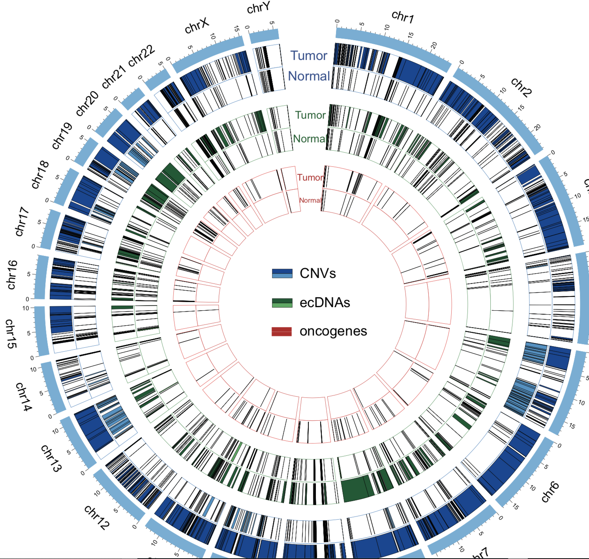  


## Figure 2 ecDNA 
`/disk1/pengweixing/gastric_wgs/08.somatic-ecDNA2/EGFR-cyle/work.sh`

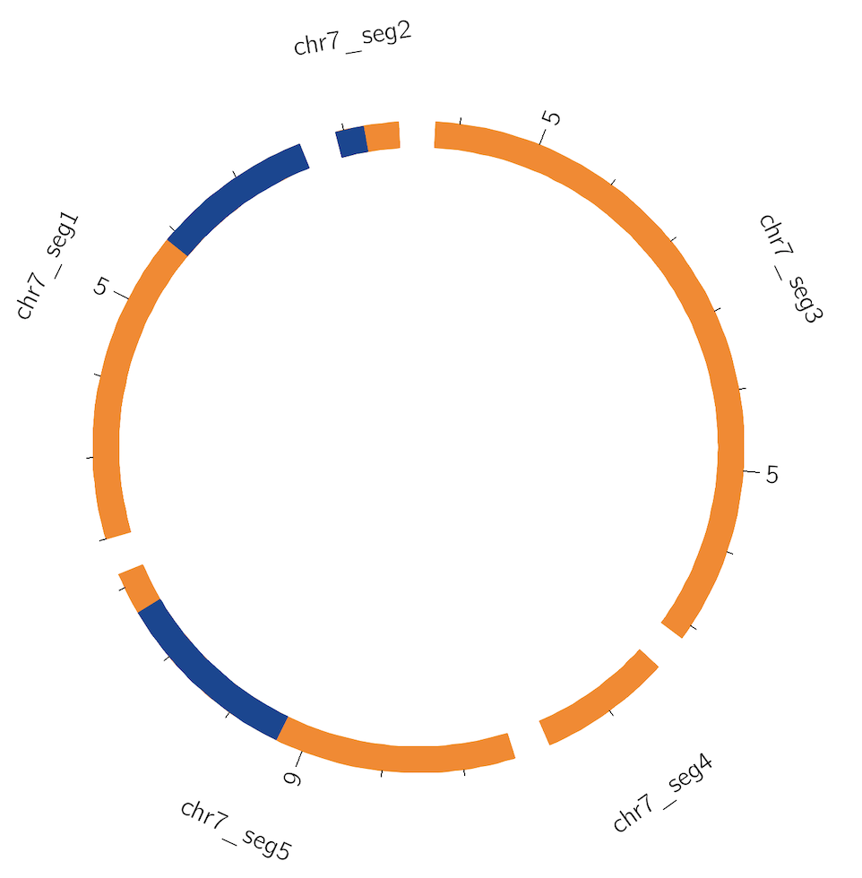  


Configure file ->
```conf
karyotype = ./karyotype.human.hg19.txt
chromosomes_units = 20000
chromosomes_order = chr7_seg3,chr7_seg4,chr7_seg5,chr7_seg1,chr7_seg2
chromosomes_reverse = chr7_seg5
<<include ideogram.conf>>

<<include /disk1/pengweixing/gastric_wgs/03.circos/ticks.conf>>

<highlights>
<highlight>
type = highlight
ideogram = yes
fill_color = vvdblue
stroke_thickness = 3
file = data/gene.bed
r0   = 0.3r
r1   = 0.5r
</highlight>
</highlights>


<image>
angle_offset* = -87
<<include image.conf>>                
</image>

<<include /disk1/pengweixing/gastric_wgs/03.circos/colors_fonts_patterns.conf>> 

<<include /disk1/pengweixing/gastric_wgs/03.circos/housekeeping.conf>>

<<include /disk1/pengweixing/gastric_wgs/03.circos/colors.conf>>
```


# 3. Heatmap
## Figure 1 
From Gastric project
`/disk1/pengweixing/gastric_wgs/02.analysis_filter/cancer_diff_matrix_heatmap.r`
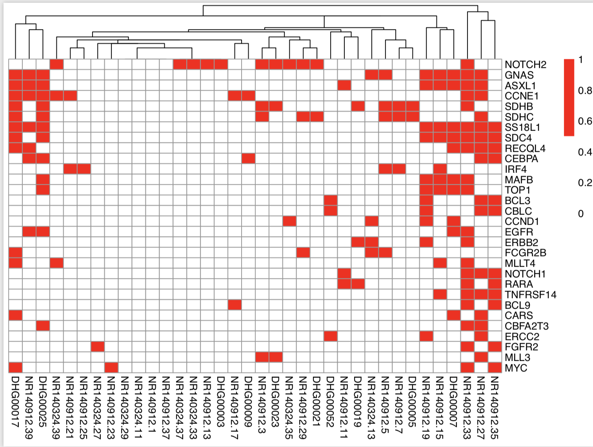  


## Figure 2
`/disk1/pengweixing/glio/02.ecDNA/stat/ecDNA_diff_matrix_heatmap.classify.r`
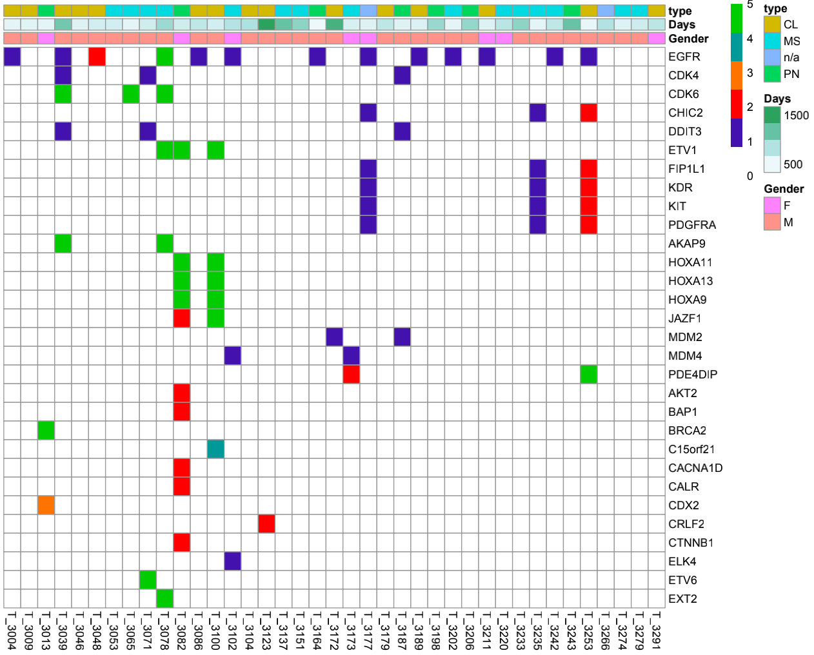  


```R 
args = commandArgs(T)
data = read.table(args[1],header = T,row.names = 1)
info = read.table('info2',header=T,row.names=1)
library(pheatmap)
pdf(paste(args[1],".pdf",sep=""),height = 8,width = 10)
pheatmap(data[1:30,],cluster_rows = 0,cluster_cols = 0,color =  c("white","#4312AE","#FF0000","#FF7400","#009999","#00CC00"),annotation_col = info)
dev.off()
```

## Figure 3  Cluster by peaks with NMF
`/disk1/pengweixing/cut-tag/X204SC20123832-Z01-F001/02.compare/cluster/cluster.nmf.r`

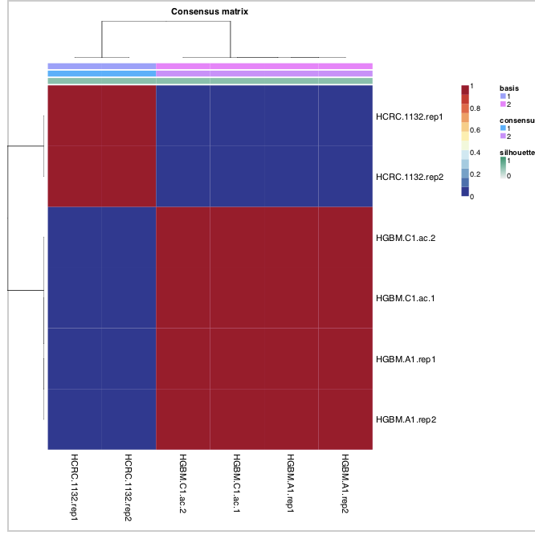  

``` R
library(NMF)
library(foreach)
library(doParallel)
library(bigmemory)
library(synchronicity)
library(limma)
library(edgeR)
args <- commandArgs(TRUE)
all_data = read.table(args[1],header=T)
gene_length=all_data[,3]-all_data[,2]
all_data=all_data[,4:length(all_data[1,])]
all_data2=apply(all_data,2,as.numeric)
data_norm=rpkm(all_data2,gene.length = gene_length)
res2 <- nmf(data_norm, 2, 'nsNMF', seed=123456,nrun=100,.pbackend='par',.opt='vp30')
pdf("cluster.nmf.pdf", width=10, height=10)
consensusmap(res2)
dev.off()
```
## Figure 4 Cluster by peaks with pheatmap
`/disk1/pengweixing/cut-tag/X204SC20123832-Z01-F001/02.compare/cluster/cluster.corr.r`
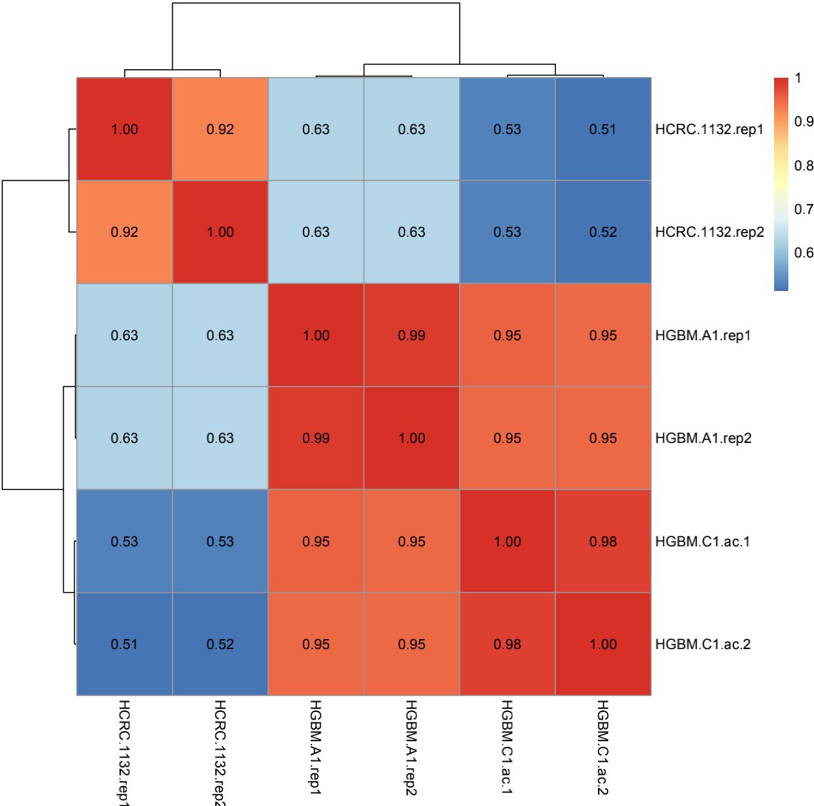  


```R
library(NMF)
library(foreach)
library(doParallel)
library(bigmemory)
library(synchronicity)
library(limma)
library(pheatmap)
library(edgeR)
args <- commandArgs(TRUE)
all_data = read.table(args[1],header=T)
gene_length=all_data[,3]-all_data[,2]
all_data=all_data[,4:length(all_data[1,])]
all_data2=apply(all_data,2,as.numeric)
data_norm=rpkm(all_data2,gene.length = gene_length)
a=cor(data_norm)
pdf("cluster.pdf", width=8, height=8)
pheatmap(a,display_numbers = T,number_color = "black",fontsize_number = 10)
dev.off()
```


# 4. Dot map
## Figure 1 
From Induced differentiation project
`/disk1/pengweixing/atac/induced_diff/analysis/01.duplicat_test/pearson.r`

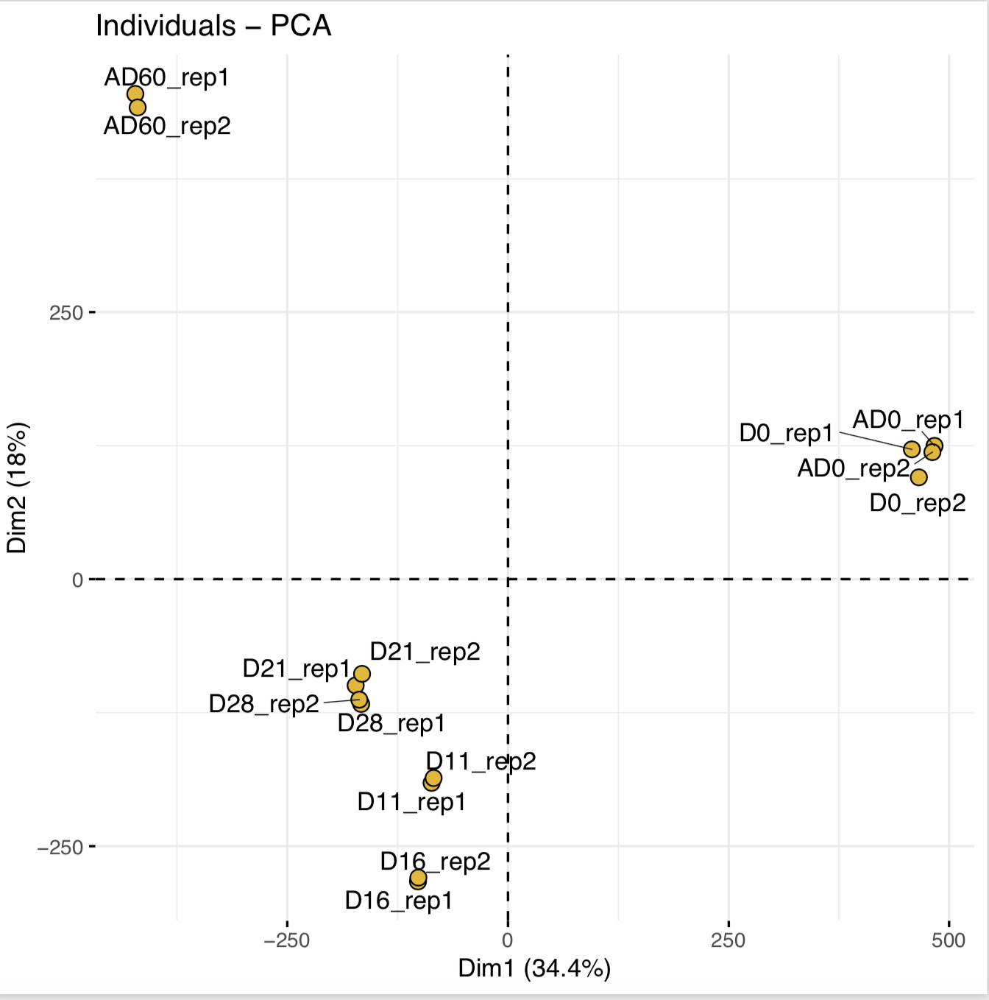  


```R
library(edgeR)
library("FactoMineR")
library("factoextra")
library(gplots)
library(RColorBrewer)    
library(ComplexHeatmap)
all_data = read.table("all.bed4.coverage2",header=T) 
gene_length = all_data[,3]-all_data[,2]
all_data = all_data[,4:length(all_data[1,])]
all_data2 = apply(all_data,2,as.numeric)
data_norm = rpkm(all_data2,gene.length = gene_length)
data_norm2 = t(data_norm)
write.table(data_norm,file="data_norm_pair.txt",row.names=FALSE,col.names=T,quote=F,sep="\t")
res.pca = PCA(data_norm2)
pdf(file="PCA.dot.pdf",width=8,height=8)
fviz_pca_ind(res.pca, pointsize = 5,
             pointshape = 21, fill = "#E7B800",
             repel = TRUE # Avoid text overlapping (slow if many points)
             )
dev.off()

name = colnames(data_norm)
name_pre_uni = unique(sapply(strsplit(name,'_'),function(x) x[1]))
nameall_pre = sapply(strsplit(colnames(data_norm),'_'),function(x) x[1])
new_data = matrix(data=NA,nrow=length(data_norm[,1]),ncol=7)
colnames(data_norm)=nameall_pre
i = 1
for(each_name in name_pre_uni){
    temp=data_norm[,which(each_name==colnames(data_norm))]
    mycor = cor(temp[,1],temp[,2])
    temp2 = apply(temp,1,mean)
    new_data[,i] = temp2
    i = i + 1
    temp=paste(each_name,mycor,sep="    ")
    print(temp)
}
new_data = as.data.frame(new_data)
colnames(new_data) = name_pre_uni
write.table(new_data,file="data_norm.txt",row.names=F,quote=F,sep="\t")
```
# 5. Histogram
## Figure 1 ChipSeeker anno
`/disk1/pengweixing/atac/induced_diff/analysis/02.correlation/enrich.r`

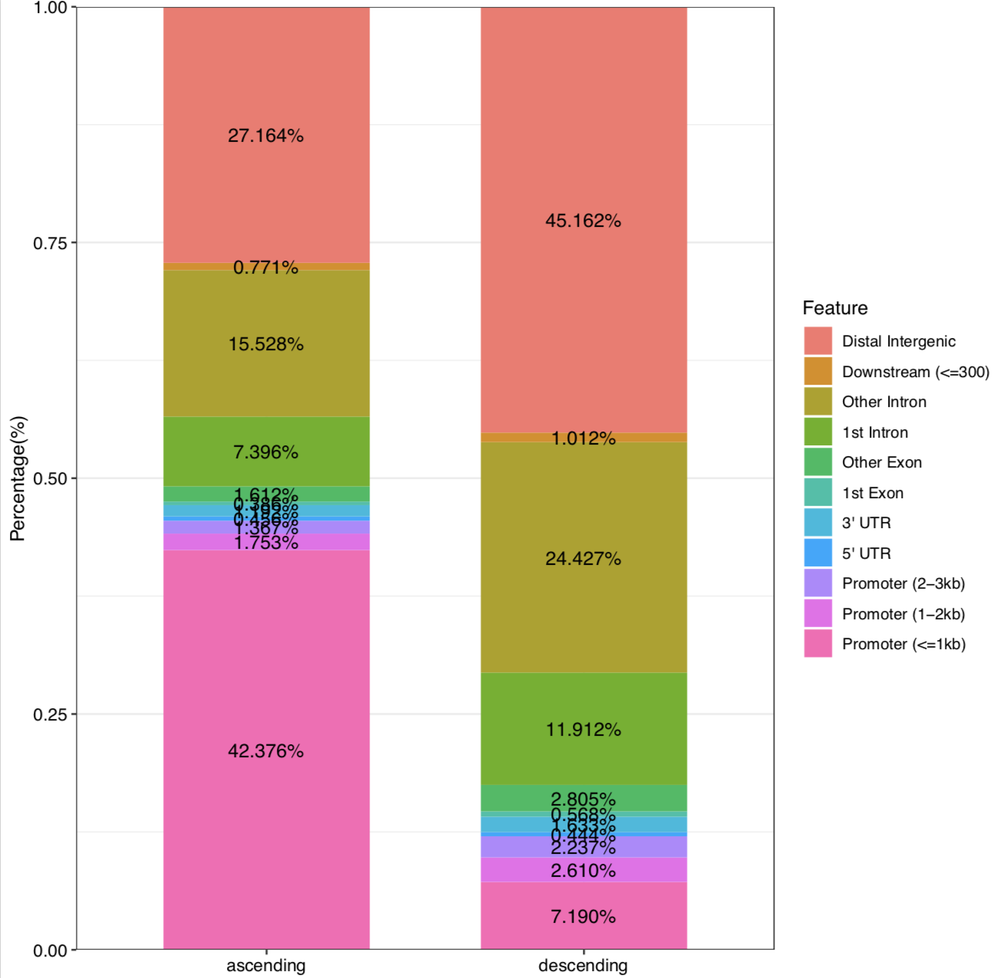  

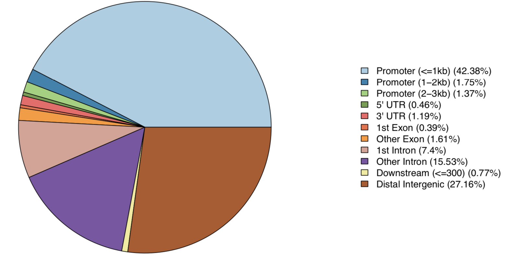  

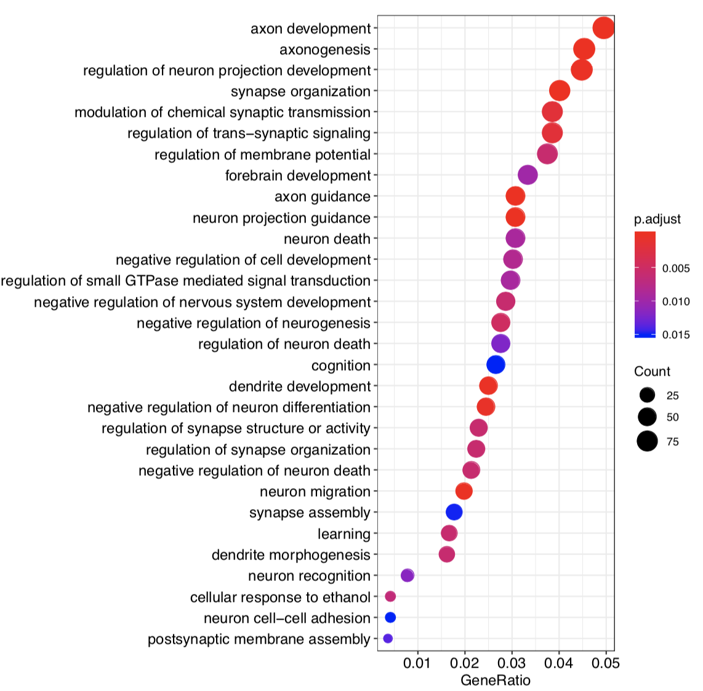  

```R
library(ChIPseeker)
library(org.Hs.eg.db)
library(TxDb.Hsapiens.UCSC.hg19.knownGene)
library(clusterProfiler)
library(ggplot2)

ascending = read.table("mypeak_cor.pcorr.rpkm5_filter.txt",header = T)
descending = read.table("mypeak_cor.ncorr.rpkm5_filter.txt",header = T)

#colnames(ascending)=c("chr","start",'end')
#colnames(descending)=c("chr","start",'end')

ascending2 = makeGRangesFromDataFrame(ascending)
descending2 = makeGRangesFromDataFrame(descending)

ascend_anno = annotatePeak(ascending2)
descend_anno = annotatePeak(descending2)
source('/disk1/pengweixing/atac/induced_diff/analysis/04.CTCF/TAD_CTCF_RAD21/plotAnno.R')
anno.df_up <- getGenomicAnnoStat(as.data.frame(ascend_anno))
anno.df_down <- getGenomicAnnoStat(as.data.frame(descend_anno))
anno.df_up$type=rep(c('ascending'))
anno.df_down$type=rep(c('descending'))
anno.df <- rbind(anno.df_up,anno.df_down)
anno.df <- rbind(anno.df_up,anno.df_down)
pdf('up_down.dist.pdf',height = 8, width = 8)
plotAnnoBar.data.frame(anno.df,categoryColumn='type')
dev.off()
stop()

pdf('ascend.pie.pdf',height = 10, width = 10)
plotAnnoPie(ascend_anno)
dev.off()
pdf('descend.pie.pdf',height = 10, width = 10)
plotAnnoPie(descend_anno)
dev.off()
ascend_anno = as.data.frame(ascend_anno)
descend_anno = as.data.frame(descend_anno)
ascd_gene = ascend_anno$geneId
dscd_gene = descend_anno$geneId

ego_ascd<- enrichGO(gene = ascd_gene,
     OrgDb = org.Hs.eg.db,
     ont = "BP",
     pAdjustMethod = "BH",
     qvalueCutoff = 0.05,
     readable = TRUE)
pdf('ego_ascd.pdf',height = 8, width = 8)
dotplot(ego_ascd,showCategory=30)
dev.off()
ego_dscd<- enrichGO(gene = dscd_gene,
     OrgDb = org.Hs.eg.db,
     ont = "BP",
     pAdjustMethod = "BH",
     qvalueCutoff = 0.05,
     readable = TRUE)
pdf('ego_dscd.pdf',height = 8, width = 8)
dotplot(ego_dscd,showCategory=30)
dev.off()
```

# 6. line plot
## Figure 1 
`/disk1/pengweixing/atac/induced_diff/analysis/04.CTCF/OCT4/distribut.sh`
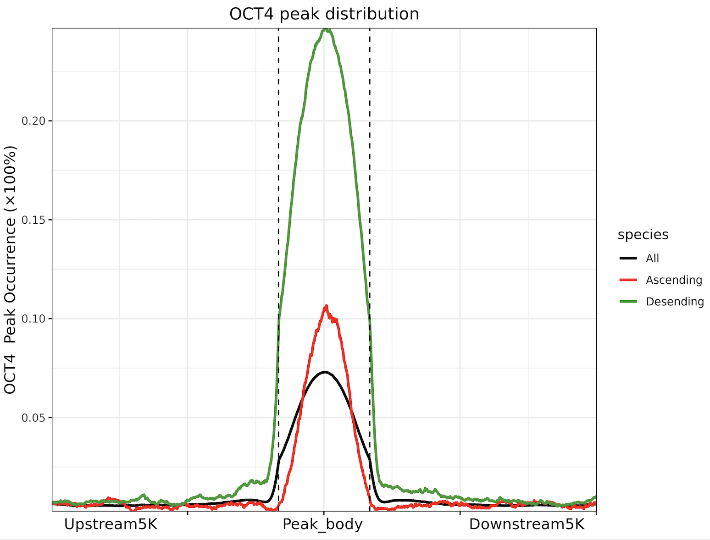  


## Figure 2
`/disk1/pengweixing/cut-tag/GM_norm_sing_reseq2/plot.sh`
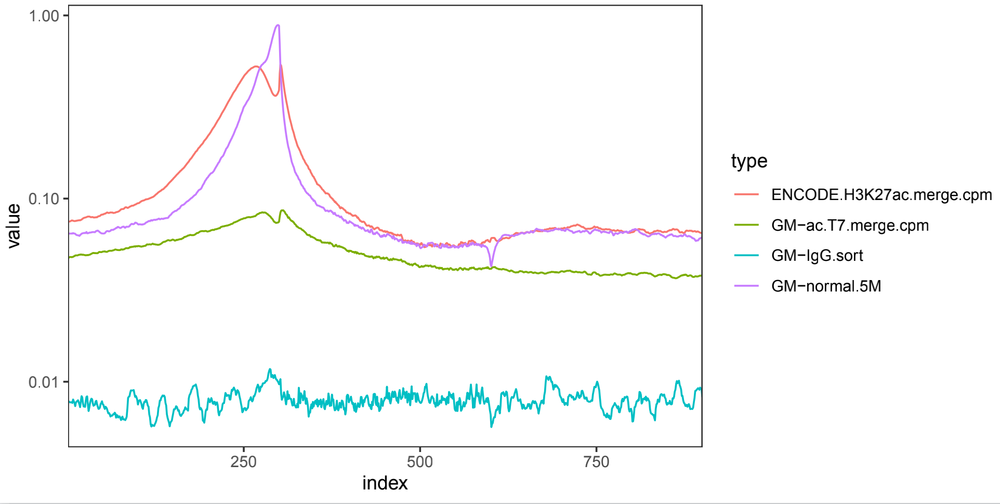  


```R
#################################################
#  File Name:mannuly_plot_tss.r
#  Author: xingpengwei
#  Mail: xingwei421@qq.com
#  Created Time: Wed 02 Dec 2020 10:49:12 PM UTC
#################################################
library(ggplot2)
library(reshape2)
library(scales)
data = read.table("all.scale-regions.data")
rownames(data)=data$V1
data2 = data[,3:ncol(data)]
data2 = as.data.frame(t(data2))
n=seq(1:nrow(data2))
index = rep(n,nrow(data))
data3=melt(data2)
data4=cbind(data3,index)
colnames(data4)=c("type","value","index")
p=ggplot(data=data4)+geom_line(aes(x=index,y=value,color=type))+scale_y_continuous(trans=log_trans(10))+theme_bw()+theme(panel.grid.major = element_blank(),panel.grid.minor = element_blank())+scale_x_continuous(expand=c(0,0))
ggsave('scale.mannuly.pdf',plot=p,width=8,height=4)
```
# 7. bar plot
`/disk1/pengweixing/cut-tag/X204SC20103657-Z01-F001/FFPE/anno/anno.r`
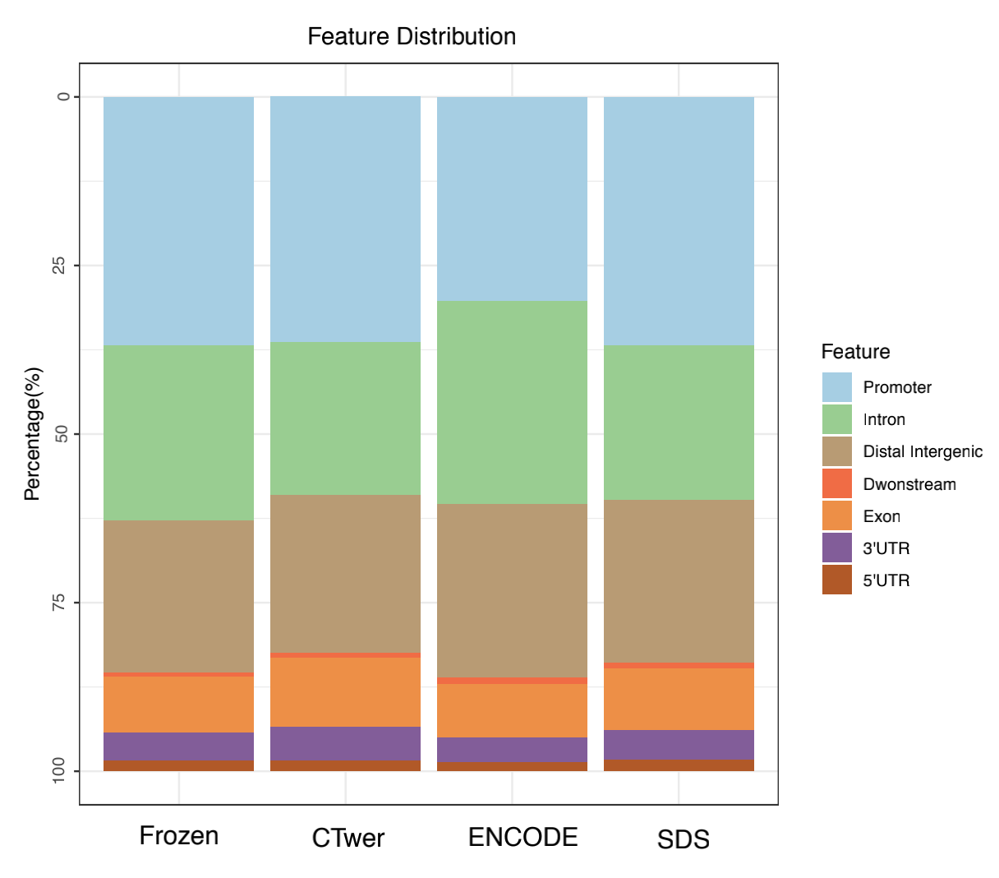  

```R
library(TxDb.Mmusculus.UCSC.mm9.knownGene)
library(ChIPseeker)

SDS_data = read.table("SDS.ac.11M.merge.bed")
colnames(SDS_data) = c("chr","start","end")
encode_data = read.table("SRR566826.sicer.merge.bed")
colnames(encode_data) = c("chr","start","end")
CTwer_data = read.table("CTwer_AC.merge.bed")
colnames(CTwer_data) = c("chr","start","end")
Frozen_data = read.table("Frozen-ac-merge2.bed")
colnames(Frozen_data) = c("chr","start","end")

bbb <- function(data)
{
SDS_data = data
SDS_data=makeGRangesFromDataFrame(SDS_data)
SDS_data_anno = annotatePeak(SDS_data,tssRegion = c(-3000,3000),TxDb=TxDb.Mmusculus.UCSC.mm9.knownGene)
SDS_anno = SDS_data_anno@annoStat
SDS_anno2 = data.frame(Feature=c("Promoter","5'UTR","3'UTR","Exon","Intron","Dwonstream","Distal Intergenic"),Frequency=c(sum(SDS_anno[1:3,2]),SDS_anno[4,2],SDS_anno[5,2],sum(SDS_anno[6:7,2]),sum(SDS_anno[8:9,2]),SDS_anno[10,2],SDS_anno[11,2]))
SDS_anno2$Feature=factor(SDS_anno2$Feature,levels = c("Promoter","Intron","Distal Intergenic","Dwonstream", "Exon","3'UTR" ,"5'UTR"))
SDS_data_anno@annoStat=SDS_anno2
return(SDS_data_anno)
}
SDS_data_anno = bbb(SDS_data)
encode_data_anno = bbb(encode_data)
CTwer_data_anno = bbb(CTwer_data)
Frozen_data_anno = bbb(Frozen_data)
all = list(SDS=SDS_data_anno,ENCODE=encode_data_anno,CTwer=CTwer_data_anno,Frozen=Frozen_data_anno)
pdf('genomic_Peakanno.pdf',width=8,height=6)
plotAnnoBar(all)
dev.off()
```

# 8. chromosome coverage 
## Figure 1 The coverage of a given region on genome
First, calculating the coverage
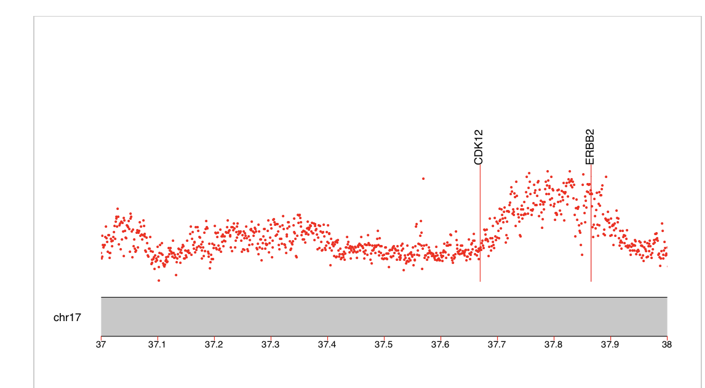  


`/disk1/pengweixing/gastric_wgs/09.chromo_plot/cov.sh`

`samtools bedcov /disk1/pengweixing/database/window_1000/chr17.bed.window M_DHG00019.bam |awk '{print $1"\t"$2"\t"$3"\t"$4/1000}' > M_DHG00019.cov`

Second, plot the figure

`Rscript plotchr17.r M_DHG00019.cov out.name`

```R
args = commandArgs(T)
library(karyoploteR)
library(Cairo)
data = read.table(args[1],header=F)
x = data$V2
y = data$V4

pdf(paste(args[2],'chr17.pdf',sep='.'), width=10, height=6)
kp <- plotKaryotype(chromosomes="chr17")
kpAddBaseNumbers(kp,tick.dist = 5000000,tick.col="red", cex=1)
kpPoints(kp, chr="chr17", x=x, y=y,ymax=100,col="red")
dev.off()

library(biomaRt)
library(regioneR)
gene.symbols <- c("CDK12","ERBB2")
ensembl <- useEnsembl(biomart="ensembl", dataset="hsapiens_gene_ensembl",GRCh = "37")
genes <- toGRanges(getBM(attributes=c('chromosome_name', 'start_position', 'end_position', 'hgnc_symbol'),filters = 'hgnc_symbol', values =gene.symbols, mart = ensembl))
seqlevelsStyle(genes) <- "UCSC"
zoom.region <- toGRanges(data.frame("chr17", 37e6, 38e6))
pdf(paste(args[2],'chr17.zoom.pdf',sep='.'), width=10, height=6)
kp <- plotKaryotype(chromosomes="chr17",zoom=zoom.region)
kpAddBaseNumbers(kp,tick.dist = 100000,tick.col="red", cex=0.8)
kpPoints(kp, chr="chr17", x=x, y=y,ymax=500,col="red")
kpPlotMarkers(kp, data=genes, labels=genes$hgnc_symbol,line.color = "red")
dev.off()
```

## Figure 2 
`/disk1/pengweixing/gastric_wgs/10.Circle_seq/04.plot/plot.r`

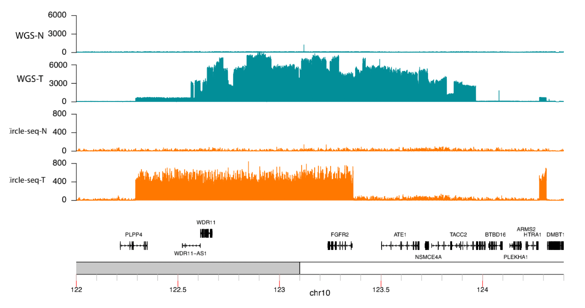  


```R

library(karyoploteR)
library(TxDb.Hsapiens.UCSC.hg19.knownGene)
library(org.Hs.eg.db)

circle.T.bigwig.file <- "/disk1/pengweixing/gastric_wgs/10.Circle_seq/01.mapping/NR140912-35-T.sort.rmdup.bam.bigWig"
circle.N.bigwig.file <- "/disk1/pengweixing/gastric_wgs/10.Circle_seq/01.mapping/NR140912-35-N.sort.rmdup.bam.bigWig"
wgs.T.bigwig.file <- "/disk1/pengweixing/gastric_wgs/01.mapping/NR140912-35/NR140912-35-N.wgs.bigWig"
wgs.N.bigwig.file <- "/disk1/pengweixing/gastric_wgs/01.mapping/NR140912-36/NR140912-36-N.wgs.bigWig"
myregion <- toGRanges("chr10:122,000,000-124,400,000")
pdf('FGFR2.zoom.pdf', width=11, height=7)
#png('FGFR2.zoom.png', width=1000, height=800)
kp <- plotKaryotype(zoom = myregion,plot.type=4)
kpAddBaseNumbers(kp, tick.dist = 500000, tick.len = 10, tick.col="red", cex=0.8,minor.tick.dist =100000, minor.tick.len = 5, minor.tick.col = "gray")
genes.data <- makeGenesDataFromTxDb(TxDb.Hsapiens.UCSC.hg19.knownGene,
                                    karyoplot=kp,
                                    plot.transcripts = TRUE,
                                    plot.transcripts.structure = TRUE)
genes.data <- addGeneNames(genes.data)
genes.data <- mergeTranscripts(genes.data)
kpPlotGenes(kp, data=genes.data, r0=0, r1=0.10, gene.name.cex = 0.7)
kpPlotBigWig(kp, data=circle.T.bigwig.file,ymin=0,ymax=800, r0=0.2, r1=0.35,col = "#FF7800",border="#FF7800")
kpAxis(kp, ymin=0, ymax=800, r0=0.2, r1=0.35)
kpAddLabels(kp, labels = "Circle-seq-T", r0=0.2, r1=0.35, cex=1.6, label.margin = 0.035)

kpPlotBigWig(kp, data=circle.N.bigwig.file,ymin=0,ymax=800, r0=0.4, r1=0.55,col = "#FF7800",border="#FF7800")
kpAxis(kp, ymin=0, ymax=800, r0=0.4, r1=0.55)
kpAddLabels(kp, labels = "Circle-seq-T", r0=0.4, r1=0.55, cex=1.6, label.margin = 0.035)

kpPlotBigWig(kp, data=wgs.T.bigwig.file,ymax=6000, r0=0.6, r1=0.75,col = "#028E98",border="#028E98")
kpAxis(kp, ymin=0, ymax=6000, r0=0.6, r1=0.75)
kpAddLabels(kp, labels = "Circle-seq-T", r0=0.6, r1=0.75, cex=1.6, label.margin = 0.035)

kpPlotBigWig(kp, data=wgs.N.bigwig.file,ymax=6000, r0=0.8, r1=0.95,col = "#028E98",border="#028E98")
kpAxis(kp, ymin=0, ymax=6000, r0=0.8, r1=0.95)
kpAddLabels(kp, labels = "Circle-seq-T", r0=0.8, r1=0.95, cex=1.6, label.margin = 0.035)
dev.off()
```

# 9. survival analysis
`/disk1/pengweixing/gastric_wgs/06.sv/cnv/call/stat/plot.r`

## Figure 1. bubble plot 
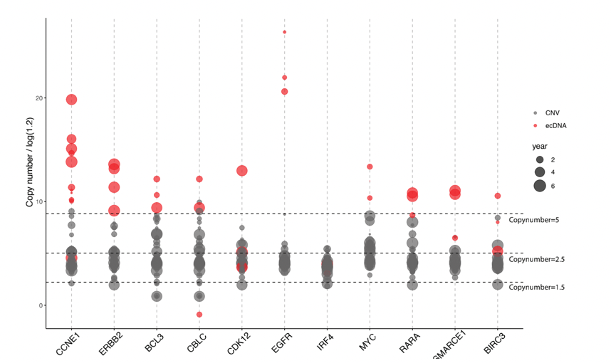  

## Figure 2. dot plot 
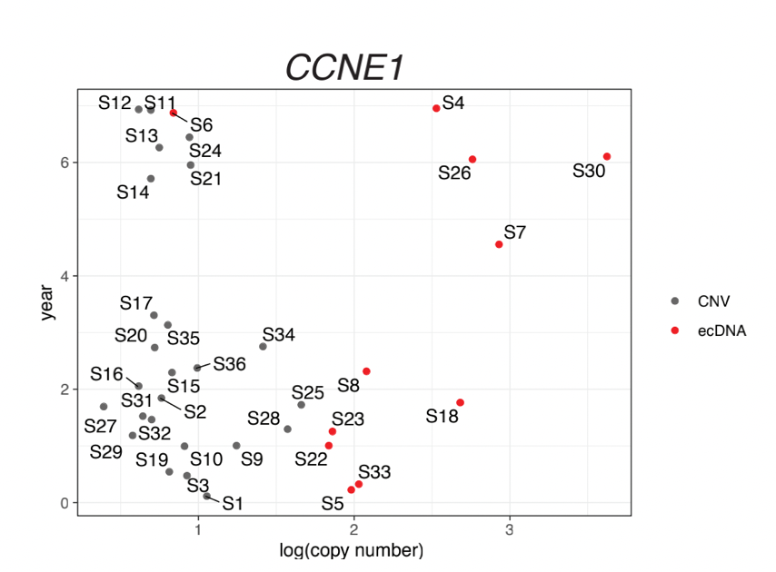  

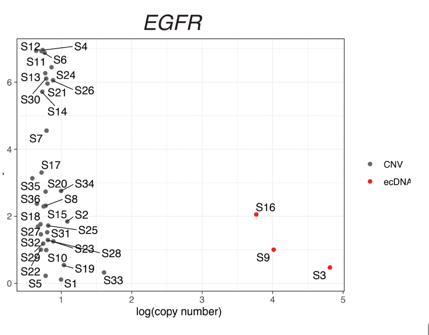  

## Figure 3. survival plot 
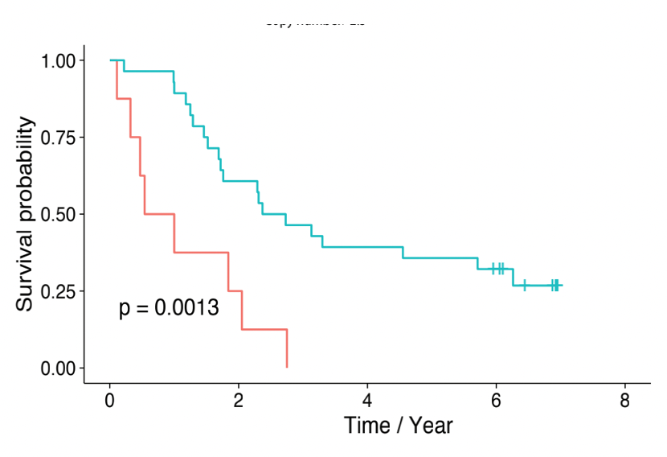  

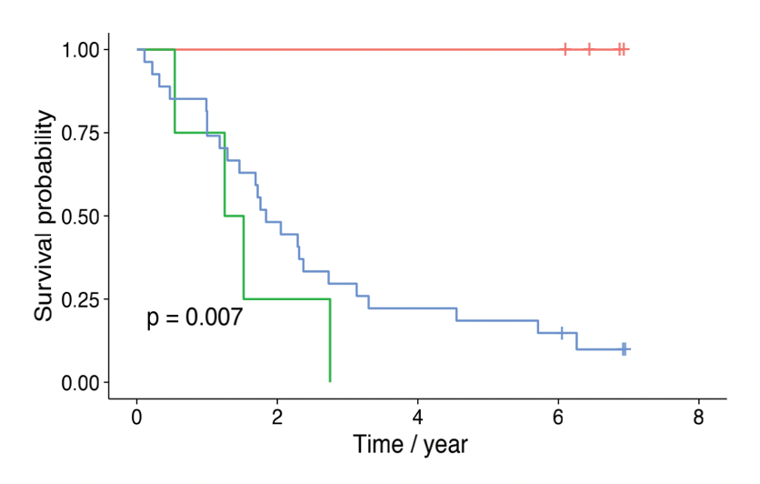  


```R
library(ggplot2)
library(ggrepel)
library(survminer)
library(survival)

data = read.table("gene.cp.survival.ecDNA7",header = T)
data2 = data
data2$copy_number =log(data$copy_number,base=1.2)
mytheme <-theme_minimal()+ theme(
        panel.grid.major.y=element_blank(), 
        panel.grid.minor.y=element_blank(),
        axis.text.x = element_text(angle = 45, hjust = 1,size=10),
        plot.title=element_text(hjust =0.5,size=12),
        axis.line.y=element_line(linetype=1,color='black'),
        axis.line.x=element_line(linetype=1,color='black'),
        axis.ticks = element_line(linetype=2,color='black'),
        panel.grid=element_line(linetype=2,color='grey'),
#        legend.background = element_rect(fill="gray90", size=0,color='white'),
#        legend.text=element_text(face="plain",size=10),
#        legend.title=element_text(face="plain",size=10),
        axis.text=element_text(face="plain",size=10)
    )
data2$gene=factor(data2$gene,levels=c("CCNE1","ERBB2","BCL3","CBLC","CDK12","EGFR","IRF4","MYC","RARA","SMARCE1","RAF1","BIRC3"))
p=ggplot(data=data2, aes(x=gene,y=copy_number))+
    geom_point(stat= "identity",aes(size=year,color=type),alpha=0.7)+
    guides(color=guide_legend(title="Type",title.hjust = 0.5))+
    scale_size(range = c(0, 8)) +
    scale_color_manual(values=c("#666666","#FF0016"))+
#    scale_y_continuous(labels = scales::percent,limits=c(y.min,1))+
#    scale_y_continuous(limits=c(y.min,10))+
    labs(x='Gene',y='Copy number/log(1.2)',title='Survial time and copy number')+
 #   geom_text(aes(y=copy_number), size=3,color="black",position = position_dodge(width=0.00),check_overlap = FALSE) 
     mytheme+ geom_hline(yintercept = log(4,base=1.2),linetype='dashed')+
     geom_hline(yintercept = log(2.5,base=1.2),linetype='dashed')+
     geom_hline(yintercept = log(1.5,base=1.2),linetype='dashed')
#    annotate(geom='text',x=0,y="copy_number=5",hjust=-0.4,vjust=-0.5)
ggsave(filename="survival.pdf",plot=p,width=12,height=6)
data3 = data
data3$copy_number =log(data$copy_number,base=2)
ccne1 = data[data$gene=="CCNE1",]
egfr = data[data$gene=="EGFR",]
erbb2 = data[data$gene=="ERBB2",]
MYC = data[data$gene=="MYC",]
row.names(MYC)=MYC$sample
row.names(ccne1)=ccne1$sample
row.names(egfr)=egfr$sample
row.names(erbb2)=erbb2$sample
p_ccne1=ggplot(data=ccne1,aes(x=log(copy_number),y=year))+geom_point(aes(color=type))+scale_color_manual(values=c("#666666","#FF0016"))+geom_text_repel(aes(log(copy_number),year,label=rownames(ccne1)))+geom_vline(xintercept = log(10),linetype='dashed')+geom_vline(xintercept = log(2.5),linetype='dashed')+theme(panel.grid.major = element_blank(),panel.grid.minor = element_blank(),panel.background = element_blank())+theme_bw()
p_egfr=ggplot(data=egfr,aes(x=log(copy_number),y=year))+geom_point(aes(color=type))+scale_color_manual(values=c("#666666","#FF0016"))+geom_text_repel(aes(log(copy_number),year,label=rownames(egfr)))+geom_vline(xintercept = log(2.5),linetype='dashed')+theme(panel.grid.major = element_blank(),panel.grid.minor = element_blank(),panel.background = element_blank())+theme_bw()
p_erbb2=ggplot(data=erbb2,aes(x=log(copy_number),y=year))+geom_point(aes(color=type))+theme_bw()+scale_color_manual(values=c("#666666","#FF0016"))+geom_text_repel(aes(log(copy_number),year,label=rownames(erbb2)))+geom_vline(xintercept = log(2.6),linetype='dashed')+geom_vline(xintercept = log(5),linetype='dashed')+theme(panel.grid.major = element_blank(),panel.grid.minor = element_blank(),panel.background = element_blank())
#p_MYC=ggplot(data=MYC,aes(x=copy_number,y=year))+geom_point(aes(color=type))+theme_bw()+scale_color_manual(values=c("#666666","#FF0016"))+geom_text_repel(aes(copy_number,year,label=rownames(egfr)))
ggsave(filename="ccne1_dotplot.pdf",plot=p_ccne1,width=6,height=4)
ggsave(filename="egfr_dotplot.pdf",plot=p_egfr,width=6,height=4)
ggsave(filename="erbb2_dotplot.pdf",plot=p_erbb2,width=6,height=4)
#ggsave(filename="MYC_dotplot.pdf",plot=p_MYC,width=6,height=4)
colnames(erbb2)=c("sample","gene","copy_number","year","ERBB2","status")
erbb2$ERBB2=as.character(erbb2$ERBB2)
erbb2[erbb2$copy_number>5,5]="High amplified"
erbb2[erbb2$copy_number>2.6 & erbb2$copy_number<5,5]="Low amplified"
erbb2[erbb2$copy_number>1.5 & erbb2$copy_number<2.6,5]="Normal"
erbb2=erbb2[-which(erbb2$copy_number<1.5),]
fit=survfit(Surv(year,status)~ERBB2,data=erbb2)
erbb2_sur=ggsurvplot(fit,pval = T)
ggsave(filename="erbb2_survival_plot.pdf",width=6,height=4)

colnames(ccne1)=c("sample","gene","copy_number","year","CCNE1","status")
ccne1$CCNE1=as.character(ccne1$CCNE1)
ccne1[ccne1$copy_number>=10,5]="High amplified"
ccne1[ccne1$copy_number>2.5 & ccne1$copy_number<10,5]="Low amplified"
ccne1[ccne1$copy_number>1.5 & ccne1$copy_number<2.5,5]="Normal"
ccne1=ccne1[-which(ccne1$copy_number<1.5),]
fit=survfit(Surv(year,status)~CCNE1,data=ccne1)
ccne1_sur=ggsurvplot(fit,pval = T)
ggsave(filename="ccne1_survival_plot.pdf",width=6,height=4)

colnames(egfr)=c("sample","gene","copy_number","year","EGFR","status")
egfr$EGFR=as.character(egfr$EGFR)
egfr[egfr$copy_number>=2.5,5]="High amplified"
egfr[egfr$copy_number>1.5 & egfr$copy_number<2.5,5]="Normal"
fit=survfit(Surv(year,status)~EGFR,data=egfr)
egfr_sur=ggsurvplot(fit,pval = T)
ggsave(filename="egfr_survival_plot.pdf",width=6,height=4)

save.image("my.Rdata")
```
